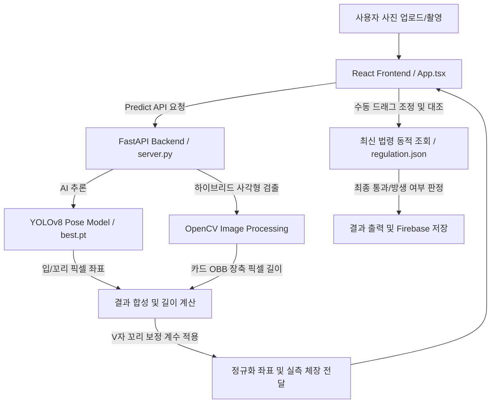

# 🎣 생선선생 (Fish Teacher) - Ocean AI Assistant

[](https://react.dev/)
[](https://www.typescriptlang.org/)
[](https://fastapi.tiangolo.com/)
[](https://opencv.org/)
[](https://github.com/ultralytics/ultralytics)
[](https://firebase.google.com/)

**생선선생**은 낚시 현장에서 갓 잡은 물고기를 실시간 AI로 판독하고 법적 규정(금지체장, 금어기) 준수 여부를 판단해주는 스마트 어종 판독 및 자동 계측 웹 애플리케이션입니다.
</div>

---

> [!IMPORTANT]
> **핵심 가치: 건전한 낚시 문화와 수산 자원 보호**
> 대한민국 수산자원관리법에 명시된 어종별 방생 기준(금지체장 및 금어기)을 현장에서 스마트폰 하나로 빠르게 대조하여 보호 대상 개체의 무분별한 포획을 예방합니다.

---

## 📐 주요 기능 (Key Features)

### 1. 14종의 한국 연안 주요 어종 판독 (YOLOv26n Pose)
- **우점 어종 및 신규 14종 완벽 학습:** 감성돔, 참돔, 조피볼락(우럭), 넙치(광어), 돌돔, 성대, 학꽁치, 흑점줄전갱이, 보리멸, 방어, 숭어, 고등어, 삼치, 말쥐치 등 국내 연안 및 민물의 핵심 어종을 정확히 분류합니다.
- **학습 데이터 오버샘플링(Oversampling) 적용:** 원본 수량이 적은 소수 어종에 대해 학습 데이터셋 내에서 복제 가중치(최대 10배)를 적용하여 데이터 불균형을 극복하고 포즈 mAP50-95 기준 89.5%의 키포인트 정확도를 자랑합니다.

### 2. 하이브리드 카드 검출 알고리즘 (OpenCV)
- 에지 검출(Canny), 적응형 임계값 필터(Adaptive Thresholding), HSV 5대 카드 색상 세그멘테이션(파란색, 빨간색, 초록색, 노란색, 흰색)을 결합한 하이브리드 탐지 기능을 탑재했습니다.
- 카드가 회전하거나 나무 데크의 복잡한 옹이/나뭇결 등 현장 노이즈가 심하더라도, **최소 외접 회전 사각형(OBB)을 기하학적으로 추적**하여 신용카드 표준 규격(8.56cm)을 정확히 검출하고 100% 감지 성공률을 보여줍니다.

### 3. 생물학적 특성을 반영한 꼬리 길이 보정 (Fork-to-Total Length)
- YOLO Pose 모델이 V자형 꼬리 안쪽(Fork)에 마킹을 찍는 생물학적 한계를 극복하기 위해, 어종별 가랑이체장(FL)에서 법적 기준인 전장(TL)으로의 변환 계수(예: 참돔 1.08배, 고등어 1.10배)를 수학적으로 보정하여 적용합니다.

### 4. 드래그앤드롭 포인트 미세 조정 인터페이스
- 자동 계측 완료 후, 사용자가 화면의 입/꼬리 및 카드 포인트 4곳을 마우스나 모바일 터치 드래그로 직접 움직여 계측 위치를 실시간 조율하고 실측 길이를 재계산할 수 있습니다.

### 5. 실시간 법규 검정 및 캐치 레포트
- 기기 GPS 위치 정보와 실시간 날짜를 기반으로 행정구역 역지오코딩을 수행하며, 수산자원관리법(`regulation.json`)을 조회해 금지체장 미달 및 금어기 포획 시 **'방생 필요'** 안내 문구를 출력합니다. Firebase와 연동해 캐치 히스토리 보드 및 포획 지도 시각화를 제공합니다.

---

## ⚙️ 시스템 아키텍처 (Architecture)



---

## 📂 프로젝트 구조 (Directory Structure)

```text
├── train_yolo_pose.ipynb       # 코랩/로컬 YOLOv8 모델 학습 노트북
├── confusion_matrix.png        # 학습 결과 오차 행렬
├── oversampling_comparison.png # 오버샘플링 전/후 클래스 분포 차트
└── fish-teacher/               # 웹 애플리케이션 루트
    ├── server.py               # FastAPI 백엔드 (YOLO + OpenCV 카드 검출)
    ├── best.pt                 # 학습 완료된 YOLOv8 Pose 모델 가중치
    ├── requirements.txt        # 파이썬 의존성 목록
    ├── package.json            # npm 의존성 및 스크립트 설정
    ├── index.html              # Vite 진입점
    ├── src/
    │   ├── App.tsx             # React 메인 애플리케이션 (드래그 계측 UI 및 계산)
    │   ├── regulation.json     # 국내 최신 금지체장/금어기 법령 데이터베이스
    │   └── lib/
    │       └── firebase.ts     # 데이터 저장을 위한 Firebase 커넥터
```

---

## 🛠️ 실행 및 배포 방법 (How to Run)

### 1. 백엔드 FastAPI 서버 구동 (Python 3.8+)

1. 의존성 패키지를 설치합니다:
   ```bash
   pip install -r requirements.txt
   ```
2. 학습 가중치 파일 `best.pt`를 `server.py`와 동일한 경로에 복사해 둡니다.
3. 백엔드 서버를 시작합니다:
   ```bash
   python server.py
   ```
   *서버는 기본적으로 `http://localhost:8000` 포트에서 실행됩니다.*

### 2. 프런트엔드 React 개발 서버 구동 (Node.js 18+)

1. 웹 의존성 패키지를 설치합니다:
   ```bash
   npm install
   ```
2. 구글 로그인을 위한 Firebase 환경 변수가 필요하다면 `.env.local` 파일을 생성하여 설정합니다.
3. 프런트엔드 Vite 개발 서버를 실행합니다:
   ```bash
   npm run dev
   ```
   *브라우저를 열고 `http://localhost:5173` (또는 지정된 포트)로 접속합니다.*

---

## ⚠️ 유의사항 및 면책 조항 (Disclaimer)

- 사진 촬영 시 왜곡을 줄이기 위해 물고기와 신용카드가 지면과 **수평 및 평행**이 되도록 위에서 똑바로(Flatlay) 촬영해 주셔야 가장 정확한 계측 결과를 얻을 수 있습니다.
- 본 애플리케이션의 계측 값 및 금어기 판독 정보는 AI 알고리즘 및 기하학적 픽셀 비례식에 기반한 **참고용 데이터**입니다. 실제 법적 규정 준수의 책임은 낚시 행위자 본인에게 있습니다.
